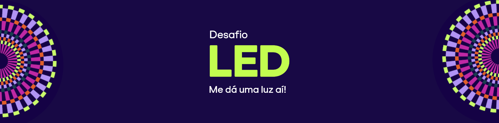

---

Tive a honra de ser um dos **80 selecionados** entre mais de 3.820 inscrições no **Desafio LED Globo – Luz na Educação.** Esta iniciativa, realizada pela Globo e pela **Fundação Roberto Marinho** em parceria com o **g1**, busca reconhecer e impulsionar projetos que reinventam os caminhos da educação no Brasil através de criatividade, impacto social e inovação.

---
## Proposta

Minha proposta foca em solucionar um problema crítico: a **evasão escolar de pessoas surdas** em escolas públicas.

A ideia consiste em uma aplicação desenvolvida em **Python**, utilizando técnicas de **Visão Computacional** para facilitar a comunicação e o aprendizado. 

Também, otimizado para rodar em dispositivos com hardware limitado, utilizando bibliotecas de alto desempenho e baixo consumo de memória, garantindo que a ferramenta de acessibilidade possa ser utilizada em laboratórios de informática de escolas públicas com equipamentos antigos

---

## Nome do Projeto

Ninguém Solta a Mão de Ninguém

---

## Tecnologias Utilizadas

**Python:** Linguagem base do projeto.

**OpenCV:** Utilizada para o processamento de imagem e captura de vídeo em tempo real.

**MediaPipe:** Framework do Google utilizado para a detecção precisa de hand landmarks (pontos de articulação das mãos), permitindo o mapeamento dos sinais.

**Exemplo::**

---

## Protótipo e Desenvolvimento

O protótipo inicial foca na detecção de um conjunto reduzido de letras para validar a precisão do algoritmo. Utilizei Inteligência Artificial para o mapeamento automático dos pontos nodais da mão, garantindo que a aplicação reconheça os gestos de forma fluida.

Apesar de não ter avançado para a fase final, a experiência nas oficinas do Movimento LED foi transformadora, ampliando minha visão sobre como estruturar projetos de tecnologia com foco em impacto social real.

---

## Links Úteis:

[Movimento LED](https://somos.globo.com/movimento-led/)

[Confira a lista dos selecionados](https://somos.globo.com/movimento-led-luz-na-educacao/desafio-led/noticia/desafio-led-globo-2026-recebe-mais-de-3820-inscricoes-e-avanca-para-a-proxima-fase.ghtml)

[Código em python do detector](detector.py)

[[Como instalar](SETUP.md)]

---

Projeto desenvolvido com foco em acessibilidade e inovação tecnológica.

---